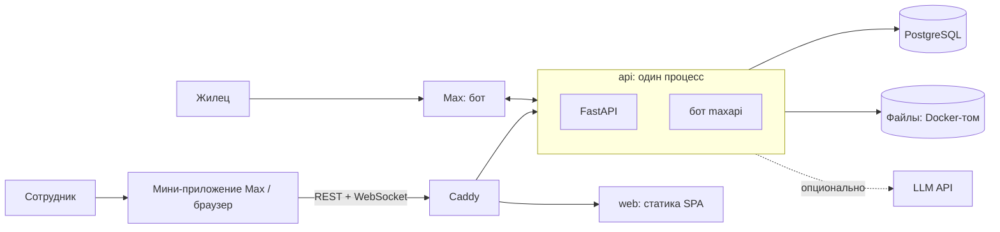

# Проект «Отзывчивый УК»

## Назначение

Сервис приёма и обработки обращений жильцов для управляющей компании (УК). Жилец пишет боту УК в мессенджере Max: подаёт заявку с фото, задаёт вопрос, следит за статусом и переписывается с УК. Сотрудники работают с обращениями в мини-приложении Max или в браузере — это одно веб-приложение. Админ видит нагрузку и сроки на дашборде, делает рассылки жильцам и настраивает бота без программиста.

Одна установка = одна УК = один бот. Проект сделан на хакатоне.

## Основной сценарий

1. Жилец открывает бота в Max → «📝 Подать заявку» → категория → адрес → описание → фото → удобное время → «Отправить». Телефон и адрес бот спрашивает только при первой заявке.
2. Бот присылает карточку заявки с номером и статусом «Новая»; менеджерам приходит уведомление с кнопкой «Открыть».
3. Менеджер открывает заявку в панели, берёт её в работу и отвечает. Жилец получает ответ в чате бота, карточка статуса обновляется.
4. Жилец отвечает обычным сообщением — бот сам определяет, к какой заявке оно относится; менеджер видит его в панели сразу, без перезагрузки.
5. Менеджер закрывает заявку. Бот спрашивает жильца «Проблема решена?»: «Да» → оценка 1–5, «Нет» → заявка снова открыта.
6. Админ на дашборде видит, сколько обращений открыто и просрочено, укладывается ли команда в сроки (4 ч на реакцию, 72 ч на решение) и как жильцы оценивают работу.

## Возможности

**Жилец — бот в Max**

- Меню: «Подать заявку», «Задать вопрос», «Мои заявки», «Оплата ЖКХ», «Услуги УК», «Аварийные службы».
- Пошаговая форма заявки: категория, адрес, описание, до 10 фото, удобное время визита.
- Переписка обычными сообщениями с подтверждением, в какую заявку ушло сообщение.
- Уведомления о смене статуса и ответах; подтверждение решения и оценка.

**Менеджер — мини-приложение или браузер**

- Список обращений с фильтрами (статус, дом, категория, «мои») и бейджем непрочитанного; обновления в реальном времени.
- Карточка: клиент, адрес, описание, фото, история статусов, чат.
- Взять в работу, ответить текстом и файлами, сменить статус, отклонить с причиной.

**Админ — всё, что менеджер, плюс**

- Дашборд: нагрузка, SLA, оценки, сравнение с прошлым периодом, выводы ИИ.
- Рассылка жильцам — всем или по домам.
- Пользователи и роли, блокировка.
- Контент бота (тексты и фото), оформление панели (название, логотип, цвет).
- Справочники домов и категорий.

Роли и скоуп подробно — [docs/product.md](docs/product.md).

## Состав и архитектура



| Компонент | Что делает | Технологии |
|---|---|---|
| `api` | REST API, WebSocket, бот Max — в одном процессе; при старте применяет миграции | Python 3.12, FastAPI, SQLAlchemy 2 (async), Alembic, Pydantic v2, `maxapi` |
| `web` | собранное SPA: мини-приложение и веб-панель | TypeScript, React 19, Vite, Tailwind CSS v4, Max UI, TanStack Query, Zustand |
| `caddy` | единая точка входа: `/api`, `/docs` → `api`, остальное → `web`; на сервере — HTTPS | Caddy 2 |
| `db` | данные сервиса | PostgreSQL 16 |

Бэкенд устроен слоями: API и бот → сервисы (бизнес-логика) → репозитории (БД); внешние системы (Max, хранилище файлов, ИИ) — через провайдеры, которые переключаются конфигом.

```
docker-compose.yml   локальный запуск всего решения
.env.example        необязательные настройки локального запуска
backend/             API + бот
frontend/            SPA: мини-приложение и веб-панель
deploy/              docker compose и Caddy для сервера
docs/                документация
```

Подробно — [docs/architecture.md](docs/architecture.md).

## Запуск одной командой

Нужен только Docker с Compose v2. Из корня репозитория:

```bash
docker compose up -d --build --wait
```

Откройте http://localhost:8080 и выберите «Анна — администратор» или «Игорь — менеджер».

Команда собирает образы, поднимает базу, применяет миграции, заполняет демо-данные и ждёт, пока все сервисы станут здоровыми. Первая сборка — 5–10 минут, дальше — секунды. Файл `.env` не нужен: локальные значения зашиты в [docker-compose.yml](docker-compose.yml), свои — через `.env` (см. [переменные](#переменные-окружения)). Бот по умолчанию выключен — панель и API работают без него.

Swagger — http://localhost:8080/docs.

## Параметры окружения

| | Локально | Сервер |
|---|---|---|
| Docker + Compose v2 | нужен | нужен |
| Свободный порт | 8080 (меняется через `WEB_PORT`) | 80 и 443 |
| Домен | не нужен | A-запись на сервер |
| Токен бота Max | не нужен; нужен, чтобы проверить бота | нужен |
| Ключ LLM API | не нужен | по желанию |

## Переменные окружения

Локально все переменные необязательны: пустое значение = значение по умолчанию. Задать свои — скопировать шаблон [.env.example](.env.example) в `.env` в корне репозитория и заполнить (Compose подставит их сам) или передать в командной строке:

```bash
cp .env.example .env
```

| Переменная | По умолчанию локально | Назначение |
|---|---|---|
| `WEB_PORT` | `8080` | порт панели на `localhost` |
| `BOT_MODE` | `off` | `polling` — включить бота; `off` — без бота, сообщения в Max не отправляются |
| `BOT_TOKEN` | — | токен бота Max; обязателен при `BOT_MODE=polling` |
| `ADMIN_MAX_USER_IDS` | — | `max_user_id` первых админов через запятую; свой id бот присылает на команду `/id` |
| `AI_INSIGHTS_ENABLED` | `true` | выводы ИИ на дашборде; `false` — выключить |
| `LLM_BASE_URL`, `LLM_MODEL` | — | OpenAI-совместимый API: адрес (без `/chat/completions`) и модель; пустые — выводов нет |
| `LLM_API_KEY` | — | ключ LLM API |
| `LLM_EXTRA_HEADERS` | `{}` | дополнительные заголовки запроса к ИИ, JSON |

Остальное локальный Compose задаёт сам: `DEBUG=true` (Swagger), `DEV_AUTH=true` (вход без Max), тестовые `SECRET_KEY` и пароль базы. На сервере переменные задаются в `deploy/.env` — шаблон с комментариями: [deploy/.env.example](deploy/.env.example). Полный список с описанием — [docs/architecture.md](docs/architecture.md#конфигурация).

Пример запуска с ботом:

```bash
BOT_MODE=polling BOT_TOKEN=<токен> docker compose up -d --wait
```

## Порты

| Порт | Где | Что |
|---|---|---|
| 8080 | локально, только `127.0.0.1` | Caddy: панель, API (`/api`), Swagger (`/docs`) |
| 80, 443 | сервер | Caddy: HTTPS и редирект с HTTP |
| 8000 | внутри сети Docker | `api` |
| 80 | внутри сети Docker | `web` |
| 5432 | внутри сети Docker | `db` |

`api`, `web` и `db` наружу не публикуются: всё идёт через Caddy.

## Зависимости

- **Для запуска:** Docker с Compose v2. Всё остальное собирается внутри образов: Python 3.12 и зависимости бэкенда — через uv по `backend/uv.lock`, Node.js 24 и зависимости фронта — через pnpm по `frontend/pnpm-lock.yaml`. Базовые образы: `python:3.12-slim`, `node:24-alpine`, `caddy:2-alpine`, `postgres:16-alpine`.
- **Для разработки без Docker:** Python 3.12 и [uv](https://docs.astral.sh/uv/), Node.js 24 и [pnpm](https://pnpm.io/), Docker для Postgres — см. [«Разработка»](#разработка).

## Внешние сервисы и интеграции

| Сервис | Зачем | Обязателен |
|---|---|---|
| **Max Bot API** | бот жильцов, уведомления сотрудникам, вход в мини-приложение по `initData` | для работы с жильцами — да; для панели и проверки локально — нет |
| **Мини-приложение Max** | панель сотрудника внутри Max; регистрируется на домен сервера | нет, панель работает и в браузере |
| **LLM API** (любой OpenAI-совместимый) | выводы ИИ на дашборде | нет, без него дашборд работает без выводов |
| **Let's Encrypt** | HTTPS-сертификат, Caddy получает его сам | только на сервере |

В ИИ уходят только агрегированные цифры дашборда: без описаний обращений, переписки и данных жильцов, имена менеджеров заменены метками.

Интеграция с базой УК (лицевой счёт → адрес) и CRM пока не реализованы — см. [ограничения](#известные-ограничения).

## Работа с данными

- **PostgreSQL** хранит пользователей и роли, дома и адреса жильцов, категории, обращения, переписку, историю статусов, контент бота, рассылки и токены входа. Таблицы и поля — [docs/data-model.md](docs/data-model.md).
- **Файлы** (фото из заявок и ответов, логотип, фото приветствия) лежат в Docker-томе `storage_data`. Публичных ссылок нет: API отдаёт ссылку с подписью, которая живёт час.
- **Схема** меняется только миграциями Alembic; `api` применяет их при каждом старте.
- **Персональные данные** — имя, телефон, адрес жильца, фото — видят только сотрудники УК. Вход — по подписанному Max `initData` или токену; каждый запрос проверяет роль.
- **Тома:** `postgres_data` — база, `storage_data` — файлы. `docker compose down` их сохраняет, `docker compose down -v` удаляет.

## Тестовые данные

При каждом старте локального Compose `api` запускает два скрипта. Оба только добавляют недостающие строки, поэтому повторный запуск ничего не дублирует.

- **`scripts/seed.py`** — справочники и демо-пользователи:
  - 4 дома, 7 категорий, тексты разделов бота;
  - пользователи для dev-входа: Анна (админ, `max_user_id` 1000001), Игорь (менеджер, 1000002), Мария (жилец, 1000003);
  - 6 обращений Марии в разных статусах, с перепиской.
- **`scripts/demo_data.py`** — полгода истории для дашборда: ~500 обращений, ещё 4 дома, 60 жильцов, 3 менеджера, переписка, оценки, просрочки. В данных заложены закономерности, которые находят выводы ИИ. Демо-жильцы вымышленные (`max_user_id` от 9 000 000 000) и в Max ничего не получают.

История строится от момента первого запуска. Пересоздать её от текущей даты или удалить — живые пользователи и их заявки не затрагиваются:

```bash
docker compose exec api python scripts/demo_data.py --reset
```

```bash
docker compose exec api python scripts/demo_data.py --delete
```

Начать с чистой базы — удалить тома и запустить заново:

```bash
docker compose down -v
```

## Сценарий проверки

После `docker compose up -d --build --wait`:

1. **Сервис жив.** `curl http://localhost:8080/api/v1/health` → `{"status":"ok"}`.
2. **Вход.** http://localhost:8080 → «Анна — администратор». Открывается дашборд.
3. **Дашборд.** Блок «Сейчас»: новые, в работе, ждут жильца, просрочено (просроченные подсвечены). Ниже — поступило, закрыто, оценка жильцов, график по дням, категории. Переключите период 7 / 30 / 90 дней — цифры и сравнение с прошлым периодом меняются.
4. **Список обращений.** «Обращения» в меню слева. Фильтры по статусу, дому и категории; у непрочитанных — синяя точка, счётчик у пункта меню.
5. **Работа с заявкой.** Откройте заявку №1000 «Течёт кран на кухне» (жилец Мария, фильтр «Новые») → «Взять в работу»: статус «В работе», исполнитель — Анна, запись в истории.
6. **Ответ.** Напишите текст в поле «Ответ жильцу» и нажмите Enter — сообщение появится в чате. С выключенным ботом в Max оно не уходит, но сохраняется.
7. **Закрытие.** «Закрыть» — несколько секунд действие можно отменить, затем статус «Закрыта», вместо поля ответа — «Обращение закрыто — писать в него нельзя», кнопка «Переоткрыть». Заявка уходит из списка активных.
8. **Отклонение.** Другая новая заявка → «⋯» → «Отклонить»: окно с обязательной причиной, которую увидит жилец; после подтверждения — статус «Отклонена».
9. **Права.** Выйдите и войдите как «Игорь — менеджер»: разделов админа (дашборд, рассылка, пользователи, контент, справочники, оформление) в меню нет.
10. **Справочники.** Под админом → «Справочники»: добавьте дом, переименуйте, отключите. Отключённый дом исчезает из фильтра списка обращений.
11. **Реальное время.** Откройте панель в двух вкладках под разными пользователями и возьмите заявку в работу в одной — во второй статус обновится сам.
12. **API.** http://localhost:8080/docs — все эндпоинты; «Authorize» принимает токен из `POST /api/v1/auth/dev` с `{"max_user_id": 1000001}`.

**Бот** (нужен свой бот в Max и его токен):

```bash
BOT_MODE=polling BOT_TOKEN=<токен> docker compose up -d --wait
```

Напишите боту `/start` → «📝 Подать заявку» и пройдите форму — заявка появится в панели. Чтобы получать уведомления сотрудника, узнайте свой id командой `/id` и перезапустите с `ADMIN_MAX_USER_IDS=<id>`.

## Примеры поведения

**API** (токен — из `POST /api/v1/auth/dev`):

| Запрос | Ответ |
|---|---|
| `GET /api/v1/health` | `200 {"status":"ok"}` |
| `GET /api/v1/staff/tickets` без токена | `401` |
| `GET /api/v1/admin/dashboard` под менеджером | `403` |
| `POST /api/v1/staff/tickets/1000/status` `{"status":"IN_PROGRESS"}` | `200`: статус `IN_PROGRESS`, `assignee` — текущий сотрудник, новая запись в `history`, `allowed_statuses` = `WAITING_CLIENT`, `CLOSED`, `REJECTED` |
| `POST …/status` `{"status":"REJECTED"}` без `comment` | `400 {"detail":"Укажите причину отклонения"}` |
| `POST …/messages` в закрытую заявку | `409 {"detail":"Обращение закрыто — написать клиенту нельзя"}` |
| `GET /api/v1/admin/dashboard/insights?period=30` без настроенного ИИ | `200 {"status":"disabled", "items":[]}` |

**Бот:**

- на «Отправить» в конце формы — карточка «Заявка №N», статус «Новая»; менеджерам — уведомление с кнопкой «Открыть»;
- ответ сотрудника приходит с шапкой «Заявка №N» и кнопкой «Ответить»;
- сообщение жильца без выбранной заявки — бот уточняет, к какой из открытых заявок оно относится, или предлагает задать вопрос;
- стикер, файл или видео в текстовом шаге формы — бот просит написать текстом и остаётся на шаге;
- после закрытия — «Проблема решена?» с кнопками «Да» / «Нет», затем оценка 1–5.

Все статусы и переходы — [docs/ticket-lifecycle.md](docs/ticket-lifecycle.md).

## Известные ограничения

- **Вход в панель из браузера** на сервере без Max пока не сделан (одноразовая ссылка по команде `/panel`): работает только dev-вход, который на сервере выключен. На сервере панель открывается из Max как мини-приложение.
- **Один процесс `api`.** Бот работает на long polling, а WebSocket-подключения живут в памяти процесса, поэтому масштабировать `api` репликами нельзя. Два процесса с одним токеном бота делят апдейты между собой — пока бот работает на сервере, локально запускайте с `BOT_MODE=off`.
- **Ограничения Max:** голосовые сообщения боту не доставляются; в одном сообщении — до 10 фото или один документ; рассылка доходит только до тех, кто уже писал боту.
- **Демо-данные в Max не существуют:** ответ демо-жильцу при включённом боте вернёт ошибку отправки. Переписку с настоящим Max показывайте на своём аккаунте.
- **Выводы ИИ** кэшируются на час; после `demo_data.py --reset` нажмите на дашборде «Обновить».
- **Не реализовано:** ML-разметка обращений (срочность, «Отфильтровано»), архив с полнотекстовым поиском, мини-приложение для жильца, интеграция с базой УК и CRM, метрики Prometheus.
- Одна установка обслуживает одну УК; мультитенантности нет.

## Остановка и повторный запуск

| Действие | Команда |
|---|---|
| Остановить, данные сохранить | `docker compose stop` |
| Запустить снова | `docker compose up -d --wait` |
| Удалить контейнеры, данные сохранить | `docker compose down` |
| Удалить всё, включая базу и файлы | `docker compose down -v` |
| Пересобрать после изменений кода | `docker compose up -d --build --wait` |
| Логи | `docker compose logs -f api` |
| Состояние | `docker compose ps` |

После повторного запуска данные на месте, а скрипты тестовых данных ничего не дублируют.

## Развёртывание на сервере

Нужны сервер с Docker, домен и открытые порты 80 и 443:

```bash
git clone https://github.com/ramismaris/uk-support-service.git
cd uk-support-service/deploy
cp .env.example .env
sed -i "s/^SECRET_KEY=.*/SECRET_KEY=$(openssl rand -hex 32)/" .env
sed -i "s/^DATABASE_PASSWORD=.*/DATABASE_PASSWORD=$(openssl rand -hex 32)/" .env
sed -i "s/^DOMAIN=.*/DOMAIN=uk.example.ru/" .env
nano .env                  # BOT_TOKEN — токен бота Max
docker compose up -d --build
```

Секреты генерируются один раз, до первого запуска: пароль базы Postgres запоминает при её создании. Caddy сам получит HTTPS-сертификат. Первый админ, демо-данные, обновление и автодеплой — [deploy/README.md](deploy/README.md).

## Разработка

Без Docker для `api` и `web` — с горячей перезагрузкой. Бэкенд, из `backend/`:

```bash
cp .env.example .env
docker compose up -d --wait db
uv sync
uv run alembic upgrade head
uv run python scripts/seed.py
uv run uvicorn src.main:app --reload
```

Фронтенд, из `frontend/`: `cp .env.example .env`, `pnpm install`, `pnpm dev` → http://localhost:5173.

Проверки перед вливанием в `main` — `backend/scripts/check.sh` (ruff, pytest, актуальность `openapi.json`, миграции) и `frontend/scripts/check.sh` (типы API, tsc, ESLint, Prettier, Steiger, Vitest, сборка). GitHub Actions повторяет их на каждый пуш. Правила кода, веток и коммитов — [AGENTS.md](AGENTS.md).

## Документация

- [docs/product.md](docs/product.md) — роли, функции, скоуп
- [docs/architecture.md](docs/architecture.md) — слои, авторизация, реалтайм, файлы, конфигурация
- [docs/data-model.md](docs/data-model.md) — таблицы и поля
- [docs/ticket-lifecycle.md](docs/ticket-lifecycle.md) — статусы, переходы, маршрутизация сообщений, уведомления
- [docs/plan.md](docs/plan.md) — план и что уже сделано
- [deploy/README.md](deploy/README.md) — развёртывание и автодеплой
