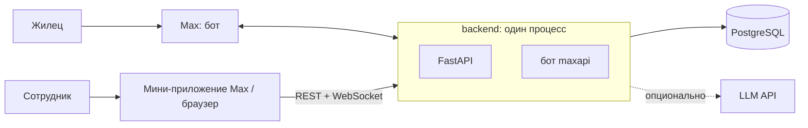

# Проект «Отзывчивый УК»

Жилец пишет боту управляющей компании в мессенджере Max: подаёт заявку с фото, задаёт вопрос, следит за статусом и переписывается с УК. Сотрудники работают с обращениями в мини-приложении Max или в браузере — это одно веб-приложение.

Проект сделан на хакатоне.

## Что умеет

**Жилец — бот в Max**

- Меню: «Подать заявку», «Задать вопрос», «Мои заявки», «Оплата ЖКХ», «Услуги УК», «Аварийные службы».
- Пошаговая форма заявки: категория, адрес, описание, до 10 фото, удобное время визита. Телефон и адрес бот спрашивает только при первой заявке.
- Переписка обычными сообщениями: бот сам понимает, к какой заявке относится сообщение, и подтверждает это.
- Уведомления о смене статуса и ответах сотрудников; после закрытия — «Проблема решена?» и оценка 1–5.

**Менеджер — мини-приложение или браузер**

- Список обращений с фильтрами и бейджем непрочитанного, обновления в реальном времени.
- Карточка обращения: клиент, адрес, описание, фото, история статусов, чат.
- Взять в работу, ответить текстом и файлами, сменить статус; уведомление о новом обращении приходит в личку от бота.

**Админ — всё, что менеджер, плюс**

- Дашборд: нагрузка, соблюдение сроков (SLA 4 ч на реакцию, 72 ч на решение), оценки, сравнение с прошлым периодом и выводы ИИ.
- Рассылка жильцам — всем или по домам.
- Пользователи и роли, блокировка.
- Тексты и фото бота, оформление панели (название, логотип, цвет).
- Справочники домов и категорий: добавить, переименовать, отключить, порядок категорий.

Роли, сценарии и скоуп подробно — [docs/product.md](docs/product.md).

## Как устроено



API и бот работают в одном процессе. Фронт — одно SPA для мини-приложения и браузера.

| | |
|---|---|
| Бэкенд | Python 3.12, FastAPI, SQLAlchemy 2 (async), Alembic, Pydantic v2, `maxapi`, PostgreSQL |
| Фронтенд | TypeScript, React 19, Vite, Tailwind CSS v4, Max UI, TanStack Query, Zustand |
| Деплой | Docker Compose, Caddy (HTTPS), GitHub Actions |
| ИИ | любой OpenAI-совместимый API, можно выключить |

```
backend/    API + бот
frontend/   SPA: мини-приложение и веб-панель
deploy/     docker compose и Caddy для сервера
docs/       документация
```

## Быстрый старт локально

Нужны Docker, [uv](https://docs.astral.sh/uv/), Node.js и [pnpm](https://pnpm.io/).

**Бэкенд** — из каталога `backend/`:

```bash
cp .env.template .env
docker compose up -d --wait db
uv sync
uv run alembic upgrade head
uv run python scripts/seed.py
uv run uvicorn src.main:app --reload
```

API — на http://localhost:8000, Swagger — http://localhost:8000/docs. Бот по умолчанию выключен (`BOT_MODE=off`), для работы панели он не нужен.

**Фронтенд** — из каталога `frontend/`, в другом терминале:

```bash
cp .env.template .env
pnpm install
pnpm dev
```

Откройте http://localhost:5173 и войдите под демо-сотрудником — админом или менеджером. Экран dev-входа работает, пока в `.env` бэкенда `DEV_AUTH=true`, а фронта — `VITE_DEV_AUTH=true`.

**Демо-история для дашборда** — полгода обращений от текущей даты; живые данные не трогает:

```bash
uv run python scripts/demo_data.py --reset
```

`--delete` — удалить её.

**Бот.** Создайте бота в Max, впишите в `backend/.env` `BOT_TOKEN=…` и `BOT_MODE=polling` и перезапустите API. Команда `/id` покажет ваш `max_user_id` — впишите его в `ADMIN_MAX_USER_IDS`, чтобы стать админом. Один токен — один запущенный процесс: два процесса на polling делят апдейты между собой.

**Выводы ИИ на дашборде** включаются, если заданы `LLM_BASE_URL`, `LLM_MODEL` и при необходимости `LLM_API_KEY`. Без них дашборд работает без выводов. Все переменные — [docs/architecture.md](docs/architecture.md#конфигурация).

## Развёртывание на сервере

Одна установка = одна УК = один бот. Нужны сервер с Docker, домен и открытые порты 80 и 443:

```bash
git clone https://github.com/ramismaris/uk-support-service.git
cd uk-support-service/deploy
cp .env.template .env
sed -i "s/^SECRET_KEY=.*/SECRET_KEY=$(openssl rand -hex 32)/" .env
sed -i "s/^DATABASE_PASSWORD=.*/DATABASE_PASSWORD=$(openssl rand -hex 32)/" .env
sed -i "s/^DOMAIN=.*/DOMAIN=uk.example.ru/" .env
nano .env                  # BOT_TOKEN — токен бота Max
docker compose up -d --build
```

Секреты генерируются один раз, до первого запуска: пароль базы Postgres запоминает при её создании.

Caddy сам получит HTTPS-сертификат, миграции бэкенд применяет при старте. Первый админ, демо-данные, обновление и автодеплой — [deploy/README.md](deploy/README.md).

## Разработка

Проверки перед вливанием в `main`:

```bash
backend/scripts/check.sh
```

```bash
frontend/scripts/check.sh
```

Бэкенд: ruff, pytest, актуальность `openapi.json`, одна «голова» Alembic. Фронтенд: типы API, tsc, ESLint, Prettier, Steiger, Vitest, сборка. Те же проверки GitHub Actions повторяет на каждый пуш в `main`.

Контракт API — `backend/openapi.json`: после изменения роутов или схем бэкенд перегенерирует его (`uv run python scripts/dump_openapi.py`), фронт обновляет типы командой `pnpm gen:api`.

Правила кода, веток и коммитов — [AGENTS.md](AGENTS.md).

## Документация

- [docs/product.md](docs/product.md) — роли, функции, скоуп
- [docs/architecture.md](docs/architecture.md) — слои, авторизация, реалтайм, файлы, конфигурация
- [docs/data-model.md](docs/data-model.md) — таблицы и поля
- [docs/ticket-lifecycle.md](docs/ticket-lifecycle.md) — статусы, переходы, маршрутизация сообщений, уведомления
- [docs/plan.md](docs/plan.md) — план и что уже сделано
- [deploy/README.md](deploy/README.md) — развёртывание и автодеплой

## Что ещё не сделано

- Вход в веб-панель через бота (`/panel`): в браузере сейчас работает только dev-вход, на проде панель открывается из Max.
- ML-разметка обращений: срочность, предложенная категория, вкладка «Отфильтровано».
- Архив с поиском, мини-приложение для жильца, интеграция с базой УК.
- Метрики для Prometheus.
