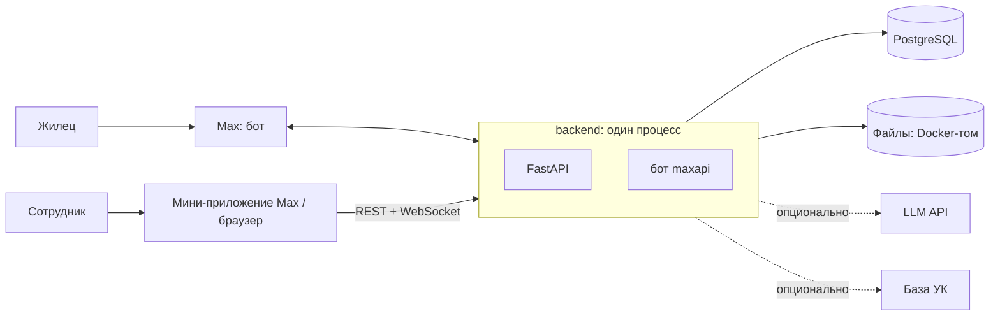

# Архитектура



## Backend

Python 3.12, FastAPI, SQLAlchemy 2 (async), Alembic, Pydantic v2, `maxapi`. Структура и паттерны взяты из `arendalike-api`.

Бот и API работают в одном процессе и одном event loop: бот запускается в `lifespan` FastAPI. Режим бота задаётся конфигом: локально — long polling (публичный адрес не нужен), в продакшене — webhook через роут FastAPI.

### Слои

Трёхслойная архитектура, у неё два входа — HTTP API и бот:

```
API (роутеры)      Бот (хендлеры)
        ↘             ↙
      Services (бизнес-логика)
              ↓
   Repositories (доступ к данным)      Providers (внешний мир)
```

| Слой | Что делает | Чего не делает |
|---|---|---|
| API | валидация запросов (Pydantic), вызов сервисов, ответы и ошибки | бизнес-логика, запросы к БД |
| Бот | разбор апдейтов Max, FSM формы, клавиатуры, вызов сервисов | бизнес-логика, запросы к БД |
| Services | вся бизнес-логика, проверка бизнес-правил, оркестрация репозиториев и провайдеров, транзакции (`commit`) | импорты FastAPI и `maxapi`: принимают обычные типы (байты, имя файла, mime), потому что их вызывают и API, и бот |
| Repositories | CRUD и запросы через SQLAlchemy | бизнес-логика, `commit` |

Чистые правила без ввода-вывода — переходы статусов, маршрутизация сообщений клиента, права — лежат в `services/ticket_rules.py` (по аналогии с `pricing.py` в arendalike) и тестируются без моков.

### Структура

```
backend/
├── pyproject.toml
├── alembic.ini
├── alembic/                  # миграции
├── scripts/                  # сиды, выгрузка openapi.json
├── src/
│   ├── main.py               # FastAPI app; lifespan запускает бота
│   ├── api/v1/
│   │   ├── auth/             # вход: initData, одноразовая ссылка, dev-вход, выход
│   │   ├── client/           # свои обращения клиента (мини-приложение)
│   │   ├── staff/            # обращения, чат, статусы — менеджер и админ
│   │   ├── admin/            # архив, пользователи, контент, справочники
│   │   ├── files/            # отдача файлов по подписанной ссылке
│   │   ├── webhooks/         # вебхук Max
│   │   ├── dependencies.py   # get_current_user, require_staff, require_admin
│   │   └── router.py
│   ├── bot/
│   │   ├── dispatcher.py     # сборка Dispatcher, polling / webhook
│   │   ├── handlers/         # меню, форма заявки, «Мои заявки», свободные сообщения, колбэки
│   │   ├── keyboards.py
│   │   └── states.py         # состояния FSM
│   ├── services/             # бизнес-логика; ticket_rules.py — чистые правила
│   ├── repositories/         # по одному на модель
│   ├── models/               # ORM, по одному файлу на модель
│   ├── schemas/              # Pydantic-схемы API
│   ├── providers/            # ABC + реализации + factory.py
│   ├── core/
│   │   ├── config.py         # pydantic-settings
│   │   ├── constants.py      # StrEnum, значения прописными
│   │   ├── exceptions.py     # AppException и наследники со status_code
│   │   ├── texts.py          # тексты бота и уведомлений
│   │   ├── security.py       # проверка initData, токены, подпись ссылок на файлы
│   │   ├── background.py     # запуск фоновых задач
│   │   ├── ws_manager.py     # WebSocket-подключения панелей
│   │   └── logging.py
│   └── db/
│       ├── base.py
│       └── session.py
└── tests/
    ├── conftest.py
    ├── unit/services/        # сервисы с замоканными репозиториями и провайдерами
    └── integration/api/      # весь стек от HTTP до тестовой БД
```

Тексты лежат в `core/texts.py`, а не в `bot/`: уведомления отправляют сервисы, а сервисы не импортируют слой бота. Тексты, которые правит админ, — в `content_blocks`.

### Провайдеры

Паттерн из arendalike: абстрактный класс, реализации и `factory.py`, который выбирает реализацию по конфигу. Сервисы зависят только от абстракции.

| Провайдер | Зачем | Реализации |
|---|---|---|
| `MessengerProvider` | отправить и отредактировать сообщение, загрузить файл в Max, скачать вложение | `MaxMessengerProvider` |
| `StorageProvider` | загрузить, прочитать, удалить файл | `LocalStorageProvider` (Docker-том); при необходимости — `S3StorageProvider` из arendalike |
| `ClassifierProvider` | ML-разметка обращения | `NoopClassifier`, `LlmClassifier` (OpenAI-совместимый API) |
| `ResidentDirectoryProvider` | данные о жильцах из базы УК | `CoreResidentDirectory` (ручной ввод), `MockResidentDirectory` (лицевые счета из сидов) |

Кнопки в `MessengerProvider` описываются нейтральной структурой (текст, тип `CALLBACK` / `LINK` / `OPEN_APP`, payload); в типы `maxapi` их переводит реализация.

`ClassifierProvider` и `ResidentDirectoryProvider` — продуктовая вариативность, на них держится история «коробка / подряд».

### Фоновые задачи

Очередей нет. `BackgroundTasks` из FastAPI не используем: сервисы вызывает и бот, где их нет. Фоновая работа — через `core/background.py`: обёртка над `asyncio.create_task`, которая хранит ссылки на задачи и логирует ошибки. Задача открывает свою сессию БД.

После создания обращения в фоне идут классификация и уведомление сотрудников (см. [ticket-lifecycle.md](ticket-lifecycle.md#ml-и-уведомление-о-новом-обращении)).

APScheduler подключаем, только если появятся периодические задачи; пока их нет.

## Авторизация

Opaque-токены, как в arendalike: случайная строка, в таблице `auth_tokens` хранится её хэш. Заголовок — `Authorization: Bearer <token>`. На каждый запрос токен проверяется по БД, роль читается из `users`; выход и снятие роли действуют сразу.

Способы получить токен:

- **Мини-приложение:** фронт отправляет `initData` из Max WebApp → бэк проверяет подпись токеном бота, создаёт пользователя при первом входе → выдаёт токен.
- **Браузер:** сотрудник пишет боту `/panel` → бот присылает одноразовую ссылку (`login_tokens`, 10 минут) → фронт меняет её на токен.
- **Разработка:** при `DEV_AUTH=true` доступен вход под любым пользователем без Max, чтобы фронт можно было разрабатывать в обычном браузере. В продакшене выключено.

Детали:

- **`initData`** проверяется по алгоритму Max ([документация](https://dev.max.ru/docs/webapps/validation), схема как в Telegram): подпись HMAC-SHA256 от ключа, выведенного из токена бота. Дополнительно отклоняем `initData` старше суток — документация этого не требует, но так перехваченную строку нельзя переиспользовать.
- **`/auth/dev`** есть в API всегда, чтобы `openapi.json` не зависел от окружения; при `DEV_AUTH=false` он отвечает 404.
- **Заблокированный** пользователь (`is_blocked`) не может войти и пользоваться уже выданными токенами — 403.
- **Первые админы** из `ADMIN_MAX_USER_IDS` получают роль при входе или первом сообщении боту. Конфиг роль только повышает; понижение — вручную в админке.

Зависимости роутов: `get_current_user`, `require_staff` (менеджер или админ), `require_admin`. Клиент через API видит только свои обращения. Автор действия (`created_by`, `changed_by_id`, `author_id`) всегда берётся из токена, а не из тела запроса.

## Реалтайм

WebSocket для сотрудников, менеджер подключений — `core/ws_manager.py` по образцу arendalike. События рассылаются всем подключённым сотрудникам: `ticket_created`, `ticket_updated`, `message_created`. Подключения живут в памяти процесса — реплика одна. Браузер не умеет передавать заголовки при открытии WebSocket, поэтому токен передаётся в query-параметре.

## Файлы

- Вложения из Max сразу скачиваются в `StorageProvider`: панели нужна стабильная ссылка.
- При отправке в Max файл загружается один раз, токен кэшируется в `files.max_token`.
- Фото из заявок — персональные данные, публичных ссылок нет. API отдаёт ссылку с подписью и сроком действия: `/api/v1/files/{id}?exp=…&sig=…` (HMAC на `SECRET_KEY`). Эндпоинт проверяет подпись, токен в ссылке не нужен — поэтому ссылка работает в ``. Поле `url` в схемах — `computed_field`, как в arendalike.
- Ссылка относительная (`/api/v1/files/…`) и живёт час: в продакшене SPA и API на одном домене за Caddy, в разработке фронт проксирует `/api` на бэкенд. Неверная или просроченная подпись — 403, файла нет — 404.
- Ответ с файлом идёт с `Content-Security-Policy: default-src 'none'; style-src 'unsafe-inline'; sandbox` и `X-Content-Type-Options: nosniff`; всё, кроме картинок, отдаётся как вложение (`attachment`). Иначе присланный клиентом HTML или SVG выполнил бы скрипт на домене панели.
- Размер файла — не больше 20 МБ. Фото приветствия и логотип загружает админ через панель (Б6); в сидах их нет.

## Frontend

Стек: — (выбирает фронтенд-разработчик).

Требования, которые от стека не зависят:

- Одно SPA. Режим определяется окружением: внутри Max (есть WebApp) или в браузере.
- Кнопка «Открыть» в уведомлении открывает мини-приложение сразу на экране обращения.
- UI-кит Max (решение созвона).
- Тема: светлая или тёмная — по Max / `prefers-color-scheme`; цвет и логотип — из блока `THEME` в `content_blocks`.

## Контракт API

`backend/openapi.json` хранится в репозитории и выгружается скриптом из `app.openapi()`, поэтому в продакшене `/docs` и `/openapi.json` можно выключить, как в arendalike. Бэкенд меняет роуты или схемы → перегенерирует `openapi.json` в том же коммите → фронт обновляется по нему. Как именно фронт использует контракт — решает фронтенд.

То, чего нет в OpenAPI, описывается в этом разделе: формат ссылки «Открыть» (Б3) и события WebSocket (Б4).

## Тесты

Как в arendalike:

- **Юнит:** сервисы, репозитории и провайдеры замоканы (`AsyncMock`), проверяется только бизнес-логика. `ticket_rules.py` — без моков.
- **Интеграционные:** `httpx.AsyncClient` + `ASGITransport` против приложения, отдельная тестовая БД `<имя>_test`. Схема создаётся через `create_all` на сессию, таблицы чистятся после каждого теста, провайдеры подменяются моками через `dependency_overrides`.
- Хендлеры бота тонкие; их логика проверяется через тесты сервисов.

## Конфигурация

`pydantic-settings`, значения из `.env`; в репозитории — `.env.template`.

| Переменная | Значение |
|---|---|
| `DATABASE_HOST`, `DATABASE_PORT`, `DATABASE_USER`, `DATABASE_PASSWORD`, `DATABASE_NAME` | URL собирается из полей — удобно для Docker |
| `SECRET_KEY` | подпись ссылок на файлы; обязателен, при `DEBUG=false` — не короче 32 символов |
| `BOT_TOKEN` | токен бота Max |
| `BOT_MODE` | `polling` / `webhook` / `off` — без бота: для фронтенд-разработки и тестов |
| `ADMIN_MAX_USER_IDS` | первые админы, через запятую |
| `WEBAPP_URL` | адрес SPA: для кнопок мини-приложения и ссылок входа |
| `STORAGE_DIR` | каталог файлов |
| `RESIDENT_DIRECTORY` | `core` / `mock` |
| `CLASSIFIER` | `noop` / `llm` |
| `LLM_BASE_URL`, `LLM_API_KEY`, `LLM_MODEL` | для `CLASSIFIER=llm` |
| `DEV_AUTH` | `true` только локально |
| `DEBUG`, `CORS_ORIGINS` | |

## Деплой

VPS, `docker compose`: `db` (Postgres), `api` (бэкенд, том для файлов), `caddy`. Caddy получает HTTPS-сертификат, раздаёт собранный фронт и проксирует `/api` на бэкенд. Одна установка = одна УК = один бот.

## Max: что известно и что проверить

По исходникам `maxapi` 1.2.2:

- **Кнопка «Начать»** присылает не `/start`, а отдельное событие `bot_started`; параметр из ссылки на бота приходит в его `payload`. Обрабатываем и `bot_started`, и `/start`.
- **Ответ (reply)**: у входящего сообщения есть `link` с типом `REPLY` и телом исходного сообщения, включая его `mid`, — правило 1 маршрутизации реализуемо, если хранить `mid` сообщений бота.
- **Кнопка `open_app`** принимает `payload`, который передаётся в `initData` мини-приложения, — так кнопка «Открыть» ведёт на конкретное обращение.
- **Состояние FSM** по умолчанию хранится в памяти процесса и теряется при перезапуске; есть вариант с Redis.
- **Polling** библиотека не рекомендует для продакшена; webhook — только по HTTPS с сертификатом доверенного центра (с 25.05.2026). Пока у бота есть webhook-подписка, polling не получает события.

Проверить вживую:

- Схема подписи `initData` мини-приложения.
- Что `payload` кнопки `open_app` действительно доходит до мини-приложения.
- Что `link` приходит при ответе на сообщение бота.
