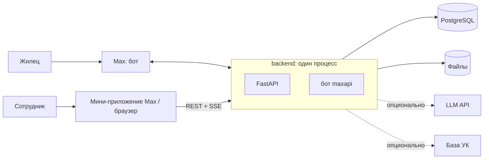

# Архитектура



## Backend

Python 3.12, FastAPI, SQLAlchemy 2 (async), Alembic, Pydantic v2, `maxapi`.

Бот и API работают в одном процессе и одном event loop: бот запускается в `lifespan` FastAPI. Режим бота задаётся конфигом: локально — long polling (публичный адрес не нужен), в продакшене — webhook через роут FastAPI.

### Слои

```
backend/src/uk_support/
  domain/          чистая логика: перечисления, переходы статусов, маршрутизация
                   сообщений, права ролей. Никаких импортов фреймворков.
  application/     сценарии: создать обращение, сменить статус, отправить сообщение…
                   ports.py — интерфейсы внешнего мира (Protocol).
  infrastructure/  реализации портов и работа с БД:
                   db/ (ORM-модели, сессия), max/ (уведомления через Max),
                   storage/, classifier/, residents/
  api/             FastAPI: роутеры, схемы запросов и ответов, авторизация, SSE
  bot/             хендлеры, клавиатуры, FSM формы, тексты бота
  config.py        настройки (pydantic-settings)
  main.py          сборка приложения и зависимостей
```

Зависимости направлены только внутрь: `api`, `bot`, `infrastructure` → `application` → `domain`.

Осознанные упрощения относительно полной чистой архитектуры:

- **Нет репозиториев.** Сценарии работают с `AsyncSession` и ORM-моделями напрямую и покрываются интеграционными тестами на настоящем Postgres.
- **Нет отдельных доменных сущностей.** `domain` работает со значениями (статус, роль, id), а не с объектами.

### Порты

| Порт | Зачем | Реализации |
|---|---|---|
| `ResidentDirectory` | данные о жильцах | `core` — ручной ввод; `mock` — лицевые счета из сидов |
| `Classifier` | ML-разметка | `noop`; `llm` — OpenAI-совместимый API |
| `Notifier` | сообщения людям в Max | `max`; fake в тестах |
| `FileStorage` | хранение файлов | `local` (диск); fake в тестах |
| `LiveUpdates` | события в открытые панели | SSE в памяти процесса; fake в тестах |

Первые два — продуктовая вариативность: на них держится история «коробка / подряд». Остальные — ради тестируемости.

### Фоновые задачи

Очередей нет. После создания обращения запускается `asyncio`-задача: классификация → уведомление сотрудников (см. [ticket-lifecycle.md](ticket-lifecycle.md#ml-и-уведомление-о-новом-обращении)). Задача открывает свою сессию БД и не роняет процесс при ошибке.

## Авторизация

- **Мини-приложение:** фронт отправляет `initData` из Max WebApp → бэк проверяет подпись токеном бота → выдаёт JWT.
- **Браузер:** сотрудник пишет боту `/panel` → бот присылает одноразовую ссылку (`login_tokens`, 10 минут) → фронт меняет токен на JWT.
- **Разработка:** `DEV_AUTH=true` включает вход под любым пользователем без Max, чтобы фронт можно было разрабатывать в обычном браузере. В продакшене выключено.
- JWT содержит только `user_id`; роль читается из БД на каждый запрос, поэтому снятие роли действует сразу.
- Клиент через API видит только свои обращения.

## Реалтайм

SSE-эндпоинт для сотрудников. События: `ticket_created`, `ticket_updated`, `message_created`. Шина — в памяти процесса: реплика одна. Браузерный `EventSource` не умеет передавать заголовки — учесть при выборе SSE-клиента на фронте.

## Файлы

Вложения из Max сразу скачиваются в `FileStorage`: панели нужна стабильная ссылка. При отправке в Max файл загружается один раз, токен кэшируется в `files.max_token`.

## Frontend

Стек: — (выбирает фронтенд-разработчик).

Требования, которые от стека не зависят:

- Одно SPA. Режим определяется окружением: внутри Max (есть WebApp) или в браузере.
- Кнопка «Открыть» в уведомлении открывает мини-приложение сразу на экране обращения.
- UI-кит Max (решение созвона).
- Тема: светлая или тёмная — по Max / `prefers-color-scheme`; цвет и логотип — из `content_blocks.theme`.

## Контракт API

`openapi.json` хранится в репозитории. Бэкенд меняет роуты или схемы → перегенерирует `openapi.json` в том же коммите → фронт обновляется по нему. Как именно фронт использует контракт (генерация клиента или типов) — решает фронтенд.

## Конфигурация

| Переменная | Значение |
|---|---|
| `BOT_TOKEN` | токен бота Max |
| `BOT_MODE` | `polling` / `webhook` |
| `DATABASE_URL` | Postgres |
| `JWT_SECRET` | |
| `ADMIN_MAX_USER_IDS` | первые админы, через запятую |
| `WEBAPP_URL` | адрес SPA: для кнопок мини-приложения и ссылок входа |
| `STORAGE_DIR` | каталог файлов |
| `RESIDENT_DIRECTORY` | `core` / `mock` |
| `CLASSIFIER` | `noop` / `llm` |
| `LLM_BASE_URL`, `LLM_API_KEY`, `LLM_MODEL` | для `CLASSIFIER=llm` |
| `DEV_AUTH` | `true` только локально |

## Деплой

VPS, `docker compose`: `postgres`, `backend`, `caddy`. Caddy получает HTTPS-сертификат, раздаёт собранный фронт и проксирует `/api` на бэкенд. Одна установка = одна УК = один бот.

## Что проверить в документации Max

- Схема подписи `initData` мини-приложения.
- Передаётся ли параметр в мини-приложение через кнопку `open_app` (для открытия конкретного обращения).
- Приходит ли в апдейте ссылка на сообщение, на которое клиент ответил (reply) — нужно для маршрутизации.
- Где `maxapi` хранит состояние FSM и переживает ли оно перезапуск.
