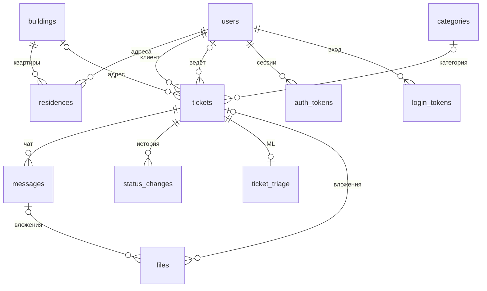

# Модель данных

PostgreSQL. Общие правила:

- `id` — `bigint generated always as identity`; UUID не используем.
- Все даты — `timestamptz`.
- Строки — `text`.
- Идентификаторы пользователей Max — `bigint`, идентификаторы сообщений Max — `text`.
- Перечисления — `StrEnum` из `core/constants.py`, значения прописными; в Postgres — enum-типы.
- Ничего не удаляем физически, кроме `auth_tokens` и `login_tokens`; справочники выключаются через `is_active`.

## users

Все, кто писал боту, включая сотрудников. Сотрудник — тоже пользователь Max: ему приходят уведомления от бота.

| Поле | Тип | Примечание |
|---|---|---|
| id | bigint PK | |
| max_user_id | bigint unique not null | |
| first_name | text not null | из Max |
| last_name | text | из Max |
| username | text | из Max |
| phone | text | из «Поделиться контактом» |
| role | enum `user_role`: `CLIENT`, `MANAGER`, `ADMIN` | default `CLIENT`; админ умеет всё, что менеджер |
| is_blocked | bool not null | default false; бот игнорирует заблокированных |
| active_ticket_id | bigint FK tickets, on delete set null | куда идут сообщения клиента вне формы; циклическая ссылка, в SQLAlchemy — `use_alter=True` |
| created_at | timestamptz not null | |
| last_seen_at | timestamptz | |

## buildings

Дома УК. Заполняет админ или сиды.

| Поле | Тип | Примечание |
|---|---|---|
| id | bigint PK | |
| address | text unique not null | |
| external_id | text unique | id дома в базе УК |
| is_active | bool not null | default true |

## residences

«Привязанные адреса» жильца.

| Поле | Тип | Примечание |
|---|---|---|
| id | bigint PK | |
| user_id | bigint FK users not null | |
| building_id | bigint FK buildings not null | |
| apartment | text not null | строка: бывает «12А» |
| account_number | text | лицевой счёт |
| is_primary | bool not null | не больше одного основного на пользователя — partial unique index `(user_id) where is_primary` |
| verified | bool not null | default false; true — подтверждено базой УК |
| created_at | timestamptz not null | |

Unique: `(user_id, building_id, apartment)`.

## categories

| Поле | Тип | Примечание |
|---|---|---|
| id | bigint PK | |
| title | text unique not null | Сантехника, Электрика, Лифт, Уборка, Благоустройство, Другое |
| sort_order | int not null | |
| is_active | bool not null | default true |

## tickets

Одна сущность для заявок и вопросов.

| Поле | Тип | Примечание |
|---|---|---|
| id | bigint PK, identity start 1000 | он же номер для людей: №1042 |
| type | enum `ticket_type`: `REQUEST`, `QUESTION` | |
| status | enum `ticket_status` | см. [ticket-lifecycle.md](ticket-lifecycle.md) |
| priority | enum `ticket_priority`: `NORMAL`, `URGENT` | default `NORMAL` |
| client_id | bigint FK users not null | |
| assignee_id | bigint FK users | кто ведёт |
| category_id | bigint FK categories | у вопросов пусто |
| building_id | bigint FK buildings | копия адреса на момент подачи |
| apartment | text | копия адреса на момент подачи |
| description | text not null | |
| contact_phone | text | копия из профиля |
| preferred_time | text | |
| status_message_max_id | text | карточка статуса в чате клиента, которую бот редактирует |
| last_client_message_at | timestamptz | для бейджа «непрочитано» |
| staff_seen_at | timestamptz | непрочитано, если `last_client_message_at > staff_seen_at` |
| rating | smallint, check 1–5 | оценка после закрытия |
| created_at | timestamptz not null | |
| updated_at | timestamptz not null | |
| closed_at | timestamptz | время перехода в `CLOSED` или `REJECTED`; при переоткрытии очищается |

Check: `type = 'QUESTION' or (building_id is not null and apartment is not null and category_id is not null)`.

Адрес копируется, а не ссылается на `residences`: если жилец потом сменит адрес, старая заявка не должна «переехать».

Индексы: `status`, `client_id`, `assignee_id`, `building_id`.

## messages

Переписка по обращению.

| Поле | Тип | Примечание |
|---|---|---|
| id | bigint PK | |
| ticket_id | bigint FK tickets not null | |
| sender_type | enum `sender_type`: `CLIENT`, `STAFF`, `SYSTEM` | `SYSTEM` — автоматические сообщения бота клиенту в контексте обращения |
| author_id | bigint FK users | пусто для `SYSTEM` |
| text | text | может быть пустым, если есть файлы |
| max_message_id | text, index | id в Max: входящие — для дедупликации, исходящие — для маршрутизации ответов (reply) клиента |
| created_at | timestamptz not null | |

## files

Фото и документы.

| Поле | Тип | Примечание |
|---|---|---|
| id | bigint PK | |
| ticket_id | bigint FK tickets | заполнен у всех вложений обращения, включая вложения сообщений |
| message_id | bigint FK messages | заполнен у вложений из чата |
| storage_key | text not null | ключ в файловом хранилище |
| mime | text not null | |
| size | int not null | байты |
| original_name | text | |
| max_token | text | токен уже загруженного в Max файла, чтобы не грузить повторно |
| created_at | timestamptz not null | |

Файлы контента (фото приветствия, логотип) — без `ticket_id` и `message_id`; на них ссылаются из `content_blocks.data`.

## status_changes

История статусов.

| Поле | Тип | Примечание |
|---|---|---|
| id | bigint PK | |
| ticket_id | bigint FK tickets not null | |
| from_status | `ticket_status` | пусто при создании обращения |
| to_status | `ticket_status` not null | |
| changed_by_id | bigint FK users | пусто — система |
| comment | text | обязателен при переходе в `REJECTED`: причину видит клиент |
| created_at | timestamptz not null | |

## ticket_triage

Результат ML, 1:1 с обращением. Отдельная таблица, чтобы ядро не зависело от необязательного компонента.

| Поле | Тип | Примечание |
|---|---|---|
| ticket_id | bigint PK, FK tickets | |
| suggested_category_id | bigint FK categories | |
| urgency | `ticket_priority` not null | |
| is_relevant | bool not null | |
| summary | text | краткая суть для менеджера |
| model | text not null | какая модель разметила |
| raw | jsonb | ответ модели целиком |
| overridden_at | timestamptz | менеджер вернул обращение из «Отфильтровано» |
| created_at | timestamptz not null | |

Вкладка «Отфильтровано»: `is_relevant = false and overridden_at is null` среди активных обращений.

## content_blocks

CMS. Ключ-значение: новый раздел не требует миграции, а данные строго проверяются Pydantic-схемой своего ключа.

| Поле | Тип | Примечание |
|---|---|---|
| key | text PK | `StrEnum ContentKey`, см. таблицу ниже |
| data | jsonb not null | |
| updated_at | timestamptz not null | |
| updated_by_id | bigint FK users | |

| key | Схема `data` |
|---|---|
| `WELCOME` | `text`, `file_id` (обязательно) |
| `EMERGENCY` | `text` |
| `SERVICES` | `text` |
| `PAYMENT` | `text`, `url`, `button_text` |
| `CONTACTS` | `text`, `phones: [{title, phone}]` |
| `THEME` | `company_name`, `primary_color`, `logo_file_id` |

## login_tokens

Вход в веб-панель по одноразовой ссылке от бота.

| Поле | Тип | Примечание |
|---|---|---|
| id | bigint PK | |
| user_id | bigint FK users not null | |
| token_hash | text unique not null | храним хэш, не сам токен |
| expires_at | timestamptz not null | 10 минут |
| used_at | timestamptz | |
| created_at | timestamptz not null | |

## auth_tokens

Сессионные opaque-токены (как в arendalike). Выход — удаление строки.

| Поле | Тип | Примечание |
|---|---|---|
| id | bigint PK | |
| user_id | bigint FK users not null | |
| token_hash | text unique not null | храним хэш, не сам токен |
| expires_at | timestamptz not null | 30 дней |
| created_at | timestamptz not null | |
