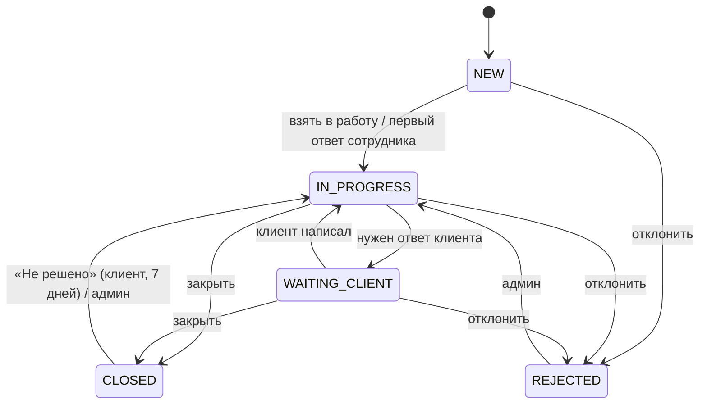

# Жизненный цикл обращения

Заявки и вопросы живут по одной схеме. Правила переходов и маршрутизации — чистые функции в `services/ticket_rules.py`, покрываются юнит-тестами без моков.

## Статусы

| Статус | Клиент видит | В панели |
|---|---|---|
| `NEW` | Принята | Активные |
| `IN_PROGRESS` | В работе | Активные |
| `WAITING_CLIENT` | Нужен ваш ответ | Активные |
| `CLOSED` | Закрыта | Архив |
| `REJECTED` | Отклонена | Архив |

«Открытые» обращения — `NEW`, `IN_PROGRESS`, `WAITING_CLIENT`.



## Переходы

«Сотрудник» — менеджер или админ.

| Из | В | Кто | Что происходит |
|---|---|---|---|
| — | NEW | клиент | создание; запись `status_changes` с пустым `from_status` |
| NEW | IN_PROGRESS | сотрудник | «Взять в работу»: `assignee_id` = сотрудник |
| NEW | IN_PROGRESS | система | первый ответ сотрудника в `NEW`: `assignee_id` = автор ответа |
| NEW, IN_PROGRESS, WAITING_CLIENT | REJECTED | сотрудник | причина обязательна и уходит клиенту |
| IN_PROGRESS | WAITING_CLIENT | сотрудник | «Нужен ответ клиента» |
| WAITING_CLIENT | IN_PROGRESS | система | клиент написал в обращение |
| IN_PROGRESS, WAITING_CLIENT | CLOSED | сотрудник | клиенту: «Проблема решена?» |
| CLOSED | IN_PROGRESS | клиент | «Нет, не решено» — не позже 7 дней после `closed_at` |
| CLOSED, REJECTED | IN_PROGRESS | админ | исправление ошибки |

Любой другой переход — ошибка домена.

- `closed_at` ставится при переходе в `CLOSED` или `REJECTED` и очищается при переоткрытии.
- `assignee_id` при переоткрытии сохраняется.
- Отвечать клиенту может любой сотрудник, не только назначенный.

## Закрытие и оценка

1. Сотрудник закрывает обращение → клиенту: «Заявка №N закрыта. Проблема решена?» [Да] [Нет].
2. «Да» → «Оцените работу» [1]…[5] → `tickets.rating`.
3. «Нет» → переоткрытие (`CLOSED → IN_PROGRESS`), уведомление назначенному сотруднику.
4. Через 7 дней «Нет» больше не переоткрывает обращение — бот предлагает создать новое.

Оценка ставится только у `CLOSED`. При повторном закрытии её можно поставить заново — перезаписывается.

## Карточка статуса

После создания обращения бот присылает карточку и дальше редактирует её при каждой смене статуса. `id` сообщения хранится в `tickets.status_message_max_id`.

```
Заявка №1042 · Сантехника
ул. Ленина, 5, кв. 12

🟢 Принята — 12:04
🟢 В работе — 12:30
⚪ Закрыта
```

Редактирование, скорее всего, не даёт push, поэтому при смене статуса клиенту дополнительно приходит короткое новое сообщение.

## Маршрутизация сообщений клиента

Когда клиент пишет боту вне формы, обращение выбирается по правилам — первое сработавшее:

1. Сообщение — ответ (reply) на сообщение бота, связанное с открытым обращением → в это обращение.
2. `users.active_ticket_id` указывает на открытое обращение → в него.
3. У клиента ровно одно открытое обращение → в него.
4. Открытых несколько → «К какой заявке относится?» [№1042] [№1051] [Новый вопрос].
5. Открытых нет → «Создать вопрос с этим текстом?» [Да] [Нет]. Текст не теряется.

`active_ticket_id` меняется, когда клиент:

- создаёт обращение;
- нажимает «Написать по заявке №N»;
- выбирает обращение на шаге 4;
- отвечает (reply) на сообщение обращения.

Сообщение в `WAITING_CLIENT` переводит обращение в `IN_PROGRESS` (см. переходы).

Сигнатура доменной функции (ориентир):

```python
def route_client_message(
    reply_to_ticket_id: int | None,
    active_ticket_id: int | None,
    open_ticket_ids: list[int],
) -> ToTicket | AskWhichTicket | OfferNewQuestion: ...
```

`open_ticket_ids` — открытые обращения этого клиента в том порядке, в каком бот покажет их на шаге 4. `reply_to_ticket_id` и `active_ticket_id` учитываются, только если они есть в этом списке, поэтому бот передаёт их как нашёл — даже если обращение уже закрыто.

## Уведомления

| Событие | Кому | Что |
|---|---|---|
| Создано обращение | клиент | карточка статуса |
| Создано обращение | все сотрудники, в личку | краткое описание + кнопка «Открыть» (мини-приложение на этом обращении); отправляется после ML-разметки, см. ниже |
| Сообщение клиента | назначенный сотрудник; если его нет — все сотрудники | текст + «Открыть» |
| Сообщение сотрудника | клиент | «💬 Заявка №N» + текст и файлы; `max_message_id` сохраняется для правила 1 маршрутизации |
| Смена статуса | клиент | короткое сообщение + обновление карточки; при отклонении — причина |
| Закрытие | клиент | «Проблема решена?» |
| «Не решено» | назначенный сотрудник | уведомление о переоткрытии |

Все события дублируются в открытые панели через WebSocket.

### ML и уведомление о новом обращении

1. Обращение сохраняется, клиент сразу получает карточку.
2. В фоне запускается классификатор, таймаут 10 секунд.
3. По результату:
   - `urgency = URGENT` → `priority = URGENT`, в уведомлении сотрудникам 🚨, клиенту — сообщение с телефоном аварийной службы из CMS;
   - `is_relevant = false` → сотрудникам в личку не пишем, обращение попадает во вкладку «Отфильтровано»;
   - иначе — обычное уведомление.
4. Ошибка или таймаут классификатора → обращение без разметки, обычное уведомление.

С `CLASSIFIER=noop` уведомление уходит сразу.
